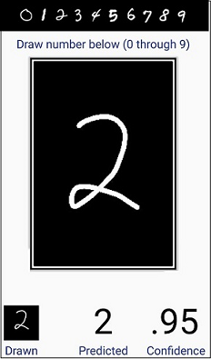
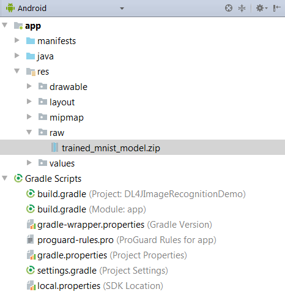

# Using Deeplearning4J in Android Applications

Contents

* [Setting the Dependencies](#head_link1)
* [Training and loading the Mnist model in the Android project resources](#head_link2)
* [Accessing the trained model using an AsyncTask](#head_link7)
* [Handling images from user input](#head_link3)
* [Testing the image](#head_link4)
* [Updating the UI](#head_link5)
* [Conclusion](#head_link6)

## DL4JImageRecognitionDemo
This example application uses a neural network trained on the standard MNIST dataset of 28x28 greyscale 0..255 pixel value images of hand drawn numbers 1..9. The application UI allows the user to draw a number which is then tested against the trained netowrk. The output displays the most probably numeric values and the probability score. This tutorial will cover the use of the trained neural network in Android studio, the handling of user generated images, and the output of the results to the UI from a background thread. For a detailed guide demonstrating how to train and saving neural networks used in this application, please see this [tutorial](https://deeplearning4j.org/quickstart). More information on prerequisits for building DL4J Android Applications can be found [here](https://github.com/jrmerwin/Skymind-Android-Documentation/blob/master/Prereqs%20and%20Configuration%20for%20Android.md). 


## <a name="head_link1">Setting the Dependencies</a>
Deeplearning4J applications requires application specific dependencies in the build.gradle file. The Deeplearning library in turn depends on the libraries of ND4J and OpenBLAS, thus these must also be added to the dependencies declaration. Starting with Android Studio 3.0, annotationProcessors need to be defined as well, thus dependencies for either -x86 or -arm processors should be included, depending on your device, if you are working in Android Studio 3.0 or later. Note that both can be include without conflict as is done in the example app.
```java
	compile 'com.android.support:appcompat-v7:27.0.2'
        compile 'com.android.support:design:27.0.2'
        compile 'org.deeplearning4j:deeplearning4j-nn:0.9.1'
        compile 'org.nd4j:nd4j-native:0.9.1'
        compile 'org.nd4j:nd4j-native:0.9.1:android-x86'
        compile 'org.nd4j:nd4j-native:0.9.1:android-arm'
        compile 'org.bytedeco.javacpp-presets:systems-platform:1.4'
        compile 'org.bytedeco.javacpp-presets:openblas:0.2.19-1.3:android-x86'
        compile 'org.bytedeco.javacpp-presets:openblas:0.2.19-1.3:android-arm'
        testCompile 'junit:junit:4.12'
```
Depending on the combination of dependencies, duplication conflicts will arise that must be fixed with exclusions. After adding the above dependencies and the exclusions listed below, sync the Gradle file add additional exclusions if needed. The error message will identify the file path that should be added to the list of exclusions. An example error message with file path: **> More than one file was found with OS independent path 'org/bytedeco/javacpp/ windows-x86_64/msvp120.dll'**
```java
packagingOptions {
 
	exclude 'META-INF/DEPENDENCIES'
	exclude 'META-INF/DEPENDENCIES.txt'
	exclude 'META-INF/LICENSE'
	exclude 'META-INF/LICENSE.txt'
	exclude 'META-INF/license.txt'
	exclude 'META-INF/NOTICE'
	exclude 'META-INF/NOTICE.txt'
	exclude 'META-INF/notice.txt'
	exclude 'META-INF/INDEX.LIST'
 
	exclude 'org/bytedeco/javacpp/windows-x86/msvcp120.dll'
	exclude 'org/bytedeco/javacpp/windows-x86_64/msvcp120.dll'
	exclude 'org/bytedeco/javacpp/windows-x86/msvcr120.dll'
	exclude 'org/bytedeco/javacpp/windows-x86_64/msvcr120.dll'
        }
```
Compiling these dependencies involves a large number of files, thus it is necessary to set multiDexEnabled to true in defaultConfig.
```java
multiDexEnabled true
```
Including multiDex will generate an 'Unable to merge dex' error which can be supressed with these additional exclusions added to the dependencies block

```java
compile 'com.google.code.findbugs:annotations:3.0.1', {
    exclude module: 'jsr305'
    exclude module: 'jcip-annotations'
}
```
Finally, a conflict in the junit module versions will give the following error: > Conflict with dependency 'junit:junit' in project ':app'. Resolved versions for app (4.8.2) and test app (4.12) differ.
This can be suppressed by focing all of the junit modules to use the same version.
```java
configurations.all {
    resolutionStrategy.force 'junit:junit:4.12'
}
```
## <a name="head_link2">Training and loading the Mnist model in the Android project resources</a>

Using a nerual network requires a significant amount of processor power, which is in limited supply on mobile devices. Thus, a background thread be used for loading of the trained neural network and the testing of the user drawn image using AsyncTask. In this application we will run image drawing code on the main thread and an AsyncTask to load the drawn image from internal memory and test it against the trained model. First, lets look at how to save the trained neural network we will be using in the application. 

You will need to begin by following the DeepLearning4J quick start [guide](https://deeplearning4j.org/quickstart) to set up, train, and save neural network models on a desktop computer. The DL4J example which trains and saves the Mnist model used in this application is *MnistImagePipelineExampleSave.java* and is included in the quick start guide referenced above. The code for the Mnist demo is also available [here](https://gist.github.com/tomthetrainer/7cb2fbc14a5c631a567a98c3134f7dd6). Running this demo will train the Mnist neural network model and save it as "trained_mnist_model.zip" in the *dl4j\target folder* of the *dl4j-examples* directory. Copy the file and save it in the raw folder of your project in android studio. 



## <a name="head_link7">Accessing the trained model using an AsyncTask</a>

Now let’s start by writing our AsyncTask<*Params*, *Progress*, *Results*> to run the neural network on a background thread. The AsyncTask will use the parameter types <String, Integer, INDArray>. The *Params* type is set to String, which will pass the Path to the saved image to the asyncTask as it is executed. This path will be used in the doInBackground() method to locate and load the trained Mnist model. The *Results* parameter is of type INDArray which will store the results from the neural network and pass it to the onPostExecute method that has access to the main thread for updating the UI. For more on NDArrays, see https://nd4j.org/userguide. 
```java
private class AsyncTaskRunner extends AsyncTask<String, Integer, INDArray> {

        // Runs in UI before background thread is called. 
        @Override
        protected void onPreExecute() {
            super.onPreExecute();
        }

        @Override
        protected INDArray doInBackground(String... params) {
            // Main background thread, this will load the model and test the input image
	    // The dimensions of the images are set here
            int height = 28;
            int width = 28;
            int channels = 1;

            //Now we load the model from the raw folder with a try / catch block
            try {
                // Load the pretrained network.
                InputStream inputStream = getResources().openRawResource(R.raw.trained_mnist_model);
                MultiLayerNetwork model = ModelSerializer.restoreMultiLayerNetwork(inputStream);

                //load the image file to test
                File f=new File(absolutePath, "drawn_image.jpg");

                //Use the nativeImageLoader to convert to numerical matrix
                NativeImageLoader loader = new NativeImageLoader(height, width, channels);

                //put image into INDArray
                INDArray image = loader.asMatrix(f);

                //values need to be scaled
                DataNormalization scalar = new ImagePreProcessingScaler(0, 1);

                //then call that scalar on the image dataset
                scalar.transform(image);

                //pass through neural net and store it in output array
                output = model.output(image);

            } catch (IOException e) {
                e.printStackTrace();
            }
            return output;
        }
```

## <a name="head_link3">Handling images from user input</a>
 
Now lets add the code for the draw canvas that will run on the main thread and allow the user to draw a number on the screen. This is a generic draw program written as an inner class within the MainActivity. It extends View and overrides a series of relevant methods. The saving of the drawing to internal memory and launching of the AsyncTask with the Path to that image are executed in the onTouchEvent case statment for case *MotionEvent.ACTION_UP*. This has the streamline action of automatically returning results for an image after the user completes the drawing. 
```java
//code for the drawing input
    public class DrawingView extends View {

        private Path    mPath;
        private Paint   mBitmapPaint;
        private Paint   mPaint;
        private Bitmap  mBitmap;
        private Canvas  mCanvas;

        public DrawingView(Context c) {
            super(c);

            mPath = new Path();
            mBitmapPaint = new Paint(Paint.DITHER_FLAG);
            mPaint = new Paint();
            mPaint.setAntiAlias(true);
            mPaint.setStrokeJoin(Paint.Join.ROUND);
            mPaint.setStrokeCap(Paint.Cap.ROUND);
            mPaint.setStrokeWidth(60);
            mPaint.setDither(true);
            mPaint.setColor(Color.WHITE);
            mPaint.setStyle(Paint.Style.STROKE);
        }

        @Override
        protected void onSizeChanged(int W, int H, int oldW, int oldH) {
            super.onSizeChanged(W, H, oldW, oldH);
            mBitmap = Bitmap.createBitmap(W, H, Bitmap.Config.ARGB_4444);
            mCanvas = new Canvas(mBitmap);
        }

        @Override
        protected void onDraw(Canvas canvas) {
            canvas.drawBitmap(mBitmap, 0, 0, mBitmapPaint);
            canvas.drawPath(mPath, mPaint);
        }

        private float mX, mY;
        private static final float TOUCH_TOLERANCE = 4;

        private void touch_start(float x, float y) {
            mPath.reset();
            mPath.moveTo(x, y);
            mX = x;
            mY = y;
        }
        private void touch_move(float x, float y) {
            float dx = Math.abs(x - mX);
            float dy = Math.abs(y - mY);
            if (dx >= TOUCH_TOLERANCE || dy >= TOUCH_TOLERANCE) {
                mPath.quadTo(mX, mY, (x + mX)/2, (y + mY)/2);
                mX = x;
                mY = y;
            }
        }
        private void touch_up() {
            mPath.lineTo(mX, mY);
            mCanvas.drawPath(mPath, mPaint);
            mPath.reset();
        }

        @Override
        public boolean onTouchEvent(MotionEvent event) {
            float x = event.getX();
            float y = event.getY();

            switch (event.getAction()) {
                case MotionEvent.ACTION_DOWN:
                    invalidate();
                    clear();
                    touch_start(x, y);
                    invalidate();
                    break;
                case MotionEvent.ACTION_MOVE:
                    touch_move(x, y);
                    invalidate();
                    break;
                case MotionEvent.ACTION_UP:
                    touch_up();
                    absolutePath = saveDrawing();
                    invalidate();
                    clear();
                    loadImageFromStorage(absolutePath);
                    onProgressBar();
                    //launch the asyncTask now that the image has been saved
                    AsyncTaskRunner runner = new AsyncTaskRunner();
                    runner.execute(absolutePath);
                    break;

            }
            return true;
        }

        public void clear(){
            mBitmap.eraseColor(Color.TRANSPARENT);
            invalidate();
            System.gc();
        }

    }

```
Now lets build a series of helper methods that save the image, load the image, and handle the progress message. First we will write the saveDrawing() method. It uses getDrawingCache() to retrieve the drawing from the drawingView and store it as a bitmap. We then create a file directory and file for the bitmap called "drawn_image.jpg". Finally, we use FileOutputStream and a try / catch block to write the bitmap to the file location. The method returns the absolutPath to the file location which will be used by the loadImageFromStorage()  method. 
```java
public String saveDrawing(){
        drawingView.setDrawingCacheEnabled(true);
        Bitmap b = drawingView.getDrawingCache();

        ContextWrapper cw = new ContextWrapper(getApplicationContext());
        // set the path to storage
        File directory = cw.getDir("imageDir", Context.MODE_PRIVATE);
        // Create imageDir and store the file there. Each new drawing will overwrite the previous
        File mypath=new File(directory,"drawn_image.jpg");

        //use a fileOutputStream to write the file to the location in a try / catch block
        FileOutputStream fos = null;
        try {
            fos = new FileOutputStream(mypath);
            b.compress(Bitmap.CompressFormat.JPEG, 100, fos);
        } catch (Exception e) {
            e.printStackTrace();
        } finally {
            try {
                fos.close();
            } catch (IOException e) {
                e.printStackTrace();
            }
        }
        return directory.getAbsolutePath();
    }
```
Next we will write the loadImageFromStorage method which will use the absolute path returned from saveDrawing() to load the saved image and display it in the UI as part of the outut display. It uses a try / catch block use a FileInputStream to set the image to the ImageView img in the UI layout.
```java
    private void loadImageFromStorage(String path)
    {

        //use a fileInputStream to read the file in a try / catch block
        try {
            File f=new File(path, "drawn_image.jpg");
            Bitmap b = BitmapFactory.decodeStream(new FileInputStream(f));
            ImageView img=(ImageView)findViewById(R.id.outputView);
            img.setImageBitmap(b);
        }
        catch (FileNotFoundException e)
        {
            e.printStackTrace();
        }

    }
```
Finally, lets write a few methods we can call to show and hide an 'In Progress...' message while the background thread is running. These will be called when the AsyncTask is executed and in the onPostExecute method when the background thread completes.
```java
    public void onProgressBar(){
        TextView bar = findViewById(R.id.processing);
        bar.setVisibility(View.VISIBLE);
    }

    public void offProgressBar(){
        TextView bar = findViewById(R.id.processing);
        bar.setVisibility(View.INVISIBLE);
    }
```
Now lets go to the onCreate method to initialize the draw canvas and set some global variables as well.
```java
public class MainActivity extends AppCompatActivity {

    MainActivity.DrawingView drawingView;
    String absolutePath;
    public static INDArray output;

    @Override
    public void onCreate(Bundle savedInstanceState) {
        super.onCreate(savedInstanceState);
        setContentView(R.layout.activity_main);

        RelativeLayout parent = findViewById(R.id.layout2);
        drawingView = new MainActivity.DrawingView(this);
        parent.addView(drawingView);
    }
```


## <a name="head_link4">Testing the image</a>

Now that our data is ready, we can build a simple multi-layer perceptron with a single hidden layer. The *DenseLayer* class is used to create the input layer and the hidden layer of the network while the *OutputLayer* class is used for the Output layer. The number of columns in the input INDArray must equal to the number of neurons in the input layer (nIn). The number of neurons in the hidden layer input must equal the number inputLayer’s output array (nOut). Finally, the outputLayer input should match the hiddenLayer output. The output must equal the number of possible classifications, which is 3.
```java
//define the layers of the network
        DenseLayer inputLayer = new DenseLayer.Builder()
                .nIn(4)
                .nOut(3)
                .name("Input")
                .build();
 
        DenseLayer hiddenLayer = new DenseLayer.Builder()
                .nIn(3)
                .nOut(3)
                .name("Hidden")
                .build();
 
        OutputLayer outputLayer = new OutputLayer.Builder(LossFunctions.LossFunction.NEGATIVELOGLIKELIHOOD)
                .nIn(3)
                .nOut(3)
                .name("Output")
                .activation(Activation.SOFTMAX)
                .build();
```
The next step is to build the neural network using *nccBuilder*. The parameters selected below for training are standard. To learn more about optimizing network training, see deeplearning4j.org.
```java
        NeuralNetConfiguration.Builder nncBuilder = new NeuralNetConfiguration.Builder();
        long seed = 6;
        nncBuilder.seed(seed);
        nncBuilder.iterations(1000);
        nncBuilder.learningRate(0.1);
        nncBuilder.activation(Activation.TANH);
        nncBuilder.weightInit(WeightInit.XAVIER);
        nncBuilder.regularization(true).l2(1e-4);
 
        NeuralNetConfiguration.ListBuilder listBuilder = nncBuilder.list();
        listBuilder.layer(0, inputLayer);
        listBuilder.layer(1, hiddenLayer);
        listBuilder.layer(2, outputLayer);
 
        listBuilder.backprop(true);
 
        MultiLayerNetwork myNetwork = new MultiLayerNetwork(listBuilder.build());
        myNetwork.init();
 
	  //Create a data set from the INDArrays and train the network
        DataSet myData = new DataSet(trainingIn, trainingOut);
        myNetwork.fit(myData);
 
	  //Evaluate the input data against the model
        INDArray actualOutput = myNetwork.output(actualInput);
        Log.d("myNetwork Output ", actualOutput.toString());
 
	  //Here we return the INDArray to onPostExecute where it can be 
	  //used to update the UI
        return actualOutput;
        }
       }
```
## <a name="head_link5">Updating the UI</a>

Once the training of the neural network and the classification of the user measurements are complete, the doInBackground() method will finish and onPostExecute() will have access to the main thread and UI, allowing us to update the UI with the classification results. Note that the decimal places reported on the probabilities can be controlled by setting a DecimalFormat pattern.
```java
//This is where we update the UI with our classification results
        @Override
        protected void onPostExecute(INDArray result) {
            super.onPostExecute(result);
 
        //Hide the progress bar now that we are finished
        ProgressBar bar = (ProgressBar) findViewById(R.id.progressBar);
        bar.setVisibility(View.INVISIBLE);
 
        //Retrieve the three probabilities
        Double first = result.getDouble(0,0);
        Double second = result.getDouble(0,1);
        Double third = result.getDouble(0,2);
 
        //Update the UI with output
        TextView setosa = (TextView) findViewById(R.id.textView11);
        TextView versicolor = (TextView) findViewById(R.id.textView12);
        TextView virginica = (TextView) findViewById(R.id.textView13);
 
        //Limit the double to values to two decimals using DecimalFormat
        DecimalFormat df2 = new DecimalFormat(".##");
 
        //Set the text of the textViews in UI to show the probabilites
        setosa.setText(String.valueOf(df2.format(first)));
        versicolor.setText(String.valueOf(df2.format(second)));
        virginica.setText(String.valueOf(df2.format(third)));
 
        }
```

## <a name="head_link6">Conclusion</a>

Hopefully this tutorial has illustrated how the compatibility of DL4J with Android makes it easy to build, train, and evaluate neural networks on mobile devices. We used a simple UI to take input values from the measurement and then passed them as the *Params* in an AsyncTask. The processor intensive steps of data preparation, network layer building, model training, and evaluation of the user data were all performed in the doInBackground() method of the background thread, maintaining a stable and responsive device. Once completed, we passed the output INDArray as the AsyncTask *Results* to onPostExecute() where the the UI was updated to demonstrate the classification results. 
The limitations of processing power and battery life of mobile devices make training robust, multi-layer networks somewhat unfeasible. To address this limitation, we will next look at an example Android application that saves the trained model on the device for faster performance after an initial model training.

The complete repo for this example is available here: https://github.com/jrmerwin/DL4JIrisClassifierDemo


