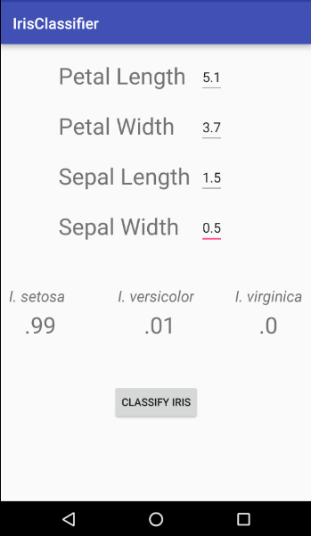

# Using Deeplearning4J in Android Applications

## DL4JIrisClassifierDemo
The example application trains a small neural network on the device using Anderson’s Iris data set for iris flower type classification. The application has a simple UI to take measurements of petal length, petal width, sepal length, and sepal width from the user and it returns the probability that the measured iris belongs to one of three types (*Iris serosa*, *Iris versicolor*, and *Iris virginica*). A data set includes 150 measurement values (50 for each iris type) and training the model takes anywhere from 5-20 seconds, depending on the device.


## Setting the Dependencies
Deeplearning4J applications require several dependencies in the build.gradle file. The Deeplearning library in turn depends on the libraries of ND4J and OpenBLAS, thus these must also be added to the dependencies declaration. Starting with Android Studio 3.0, annotationProcessors need to be defined as well, thus dependencies for either -x86 or -arm processors should be included, depending on your device, if you are working in Android Studio 3.0 or later. Note that both can be include without conflict as is done in the example app.
```java
	compile 'org.deeplearning4j:deeplearning4j-core:0.8.0'
	compile 'org.nd4j:nd4j-native:0.8.0'
	compile 'org.nd4j:nd4j-native:0.8.0:android-x86'
	compile 'org.nd4j:nd4j-native:0.8.0:android-arm'
	compile 'org.bytedeco.javacpp-presets:openblas:0.2.19-1.3:android-x86'
  compile 'org.bytedeco.javacpp-presets:openblas:0.2.19-1.3:android-arm'
```
Some conflicts exist within these dependencies that must be handled in the build.gradle file. The DL4J and ND4J libraries have several identically named files in them which requires exclusion parameters in the packagingOptions. After added the above dependencies to the build.gradle file, try syncing Gradle with the below exclusions and add additional exclusions if needed. The error message will identify the file path that should be added to the list of exclusions. An example error message with file path: > More than one file was found with OS independent path 'org/bytedeco/javacpp/ windows-x86_64/msvp120.dll'
```java
packagingOptions {
 
	exclude 'META-INF/DEPENDENCIES'
	exclude 'META-INF/DEPENDENCIES.txt'
	exclude 'META-INF/LICENSE'
	exclude 'META-INF/LICENSE.txt'
	exclude 'META-INF/license.txt'
	exclude 'META-INF/NOTICE'
	exclude 'META-INF/NOTICE.txt'
	exclude 'META-INF/notice.txt'
	exclude 'META-INF/INDEX.LIST'
 
	exclude 'org/bytedeco/javacpp/windows-x86/msvcp120.dll'
	exclude 'org/bytedeco/javacpp/windows-x86_64/msvcp120.dll'
	exclude 'org/bytedeco/javacpp/windows-x86/msvcr120.dll'
	exclude 'org/bytedeco/javacpp/windows-x86_64/msvcr120.dll'
        }
```
Finally, compiling these dependencies involves a large number of files, thus it is necessary to set multiDexEnabled to true in defaultConfig.
```java
multiDexEnabled true
```
## Setting up the neural network on a background thread
Training even a simple neural network like in this example requires a significant amount of processor power, which is in limited supply on mobile devices. Thus, it is imperative that a background thread be used for the building and training of the neural network which then returns the output to the main thread for updating the UI. In this example we will be using an AsyncTask which accepts the input measurements from the UI and passes them as type double to the doInBackground() method. First, lets get references to the editTexts in the UI layout that accept the iris measurements inside of our onCreate method. Then an onClickListener will execute our asyncTask, pass it the measurements entered by the user, and show a progress bar until we hide it again in onPostExecute().
```java
public class MainActivity extends AppCompatActivity {
 
 
@Override
    public void onCreate(Bundle savedInstanceState) {
        super.onCreate(savedInstanceState);
        setContentView(R.layout.activity_main);
 
        //get references to the editTexts that take the measurements
        final EditText PL = (EditText) findViewById(R.id.editText);
        final EditText PW = (EditText) findViewById(R.id.editText2);
        final EditText SL = (EditText) findViewById(R.id.editText3);
        final EditText SW = (EditText) findViewById(R.id.editText4);
 
	  //onclick to capture the input and launch the asyncTask
        Button button = (Button) findViewById(R.id.button);
 
        button.setOnClickListener(new View.OnClickListener() {
            @Override
            public void onClick(View v) {
 
                final double pl = Double.parseDouble(PL.getText().toString());
                final double pw = Double.parseDouble(PW.getText().toString());
                final double sl = Double.parseDouble(SL.getText().toString());
                final double sw = Double.parseDouble(SW.getText().toString());
 
                AsyncTaskRunner runner = new AsyncTaskRunner();
 
		   //pass the measurement as params to the AsyncTask
                runner.execute(pl,pw,sl,sw);
 
                ProgressBar bar = (ProgressBar) findViewById(R.id.progressBar);
                bar.setVisibility(View.VISIBLE);
            }
        });
        }
```
Now let’s write our AsyncTask<*Params*, *Progress*, *Results*>. The AsyncTask needs to have a *Params* of type Double to receive the decimal value measurements from the UI. The *Result* type is set to INDArray, which is returned from the doInBackground() Method and passed to the onPostExecute() method for updating the UI. NDArrays are provided by the ND4J library and are essentially n-dimensional arrays with a given number of dimensions. For more on NDArrays, see https://nd4j.org/userguide. 
```java
private class AsyncTaskRunner extends AsyncTask<Double, Integer, INDArray> {
 
        // Runs in UI before background thread is called
        @Override
        protected void onPreExecute() {
            super.onPreExecute();
 
            ProgressBar bar = (ProgressBar) findViewById(R.id.progressBar);
            bar.setVisibility(View.INVISIBLE);
        }
```


